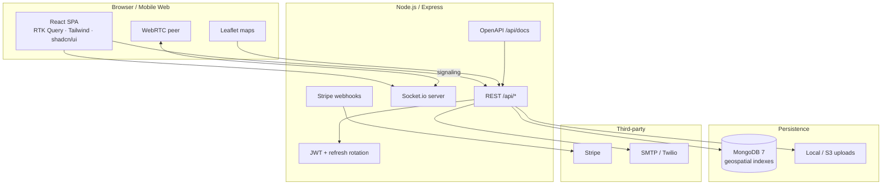

<p align="center">
  
</p>

<h1 align="center">LifeCare+</h1>

<p align="center">
  <strong>End-to-end digital health platform</strong> — teleconsultation, emergency dispatch, pharmacy, and payments in one product surface.<br/>
  Built as a production-grade MERN monorepo with real-time tracking, WebRTC video, and Stripe-native billing.
</p>

<p align="center">
  <a href="https://lifecare-frontend.up.railway.app"><strong>Live Demo →</strong></a>
  &nbsp;·&nbsp;
  <a href="https://lifecare-backend.up.railway.app/api/docs">API Docs</a>
  &nbsp;·&nbsp;
  <a href="https://lifecare-backend.up.railway.app/health">Health Check</a>
</p>

<p align="center">
  
  
  
  
  
  
  
</p>

---

## Live demo

| | URL |
|---|---|
| **App** | [lifecare-frontend.up.railway.app](https://lifecare-frontend.up.railway.app) |
| **API** | [lifecare-backend.up.railway.app/api](https://lifecare-backend.up.railway.app/api) |
| **Swagger** | [lifecare-backend.up.railway.app/api/docs](https://lifecare-backend.up.railway.app/api/docs) |

All seeded accounts use password **`Password@123`**.

| Role | Email | Use case |
|------|-------|----------|
| **Patient** | `patient@demo.com` | Book consults, SOS, pharmacy checkout, wallet |
| **Doctor** | `dr.kavitha@lifecare.com` | Accept appointments, video consult, prescriptions |
| **Admin** | `admin@lifecare.com` | Platform analytics, user moderation, verification |

> One-click **Demo Login** is available on the auth screen. OTP login (`9876543210`) is also supported.

---

## Why it's technically interesting

Not a CRUD demo — each core flow maps to patterns you'd ship in a health-tech product.

| Capability | What we built |
|------------|---------------|
| **WebRTC teleconsult** | Peer signaling over Socket.io (`offer` / `answer` / `ice-candidate`); room join gated on auth + payment status |
| **Emergency SOS** | Sub-second dispatch pipeline — geo-matched driver assignment, live GPS streaming, pickup OTP verification |
| **Real-time layer** | Socket.io rooms for consult, SOS, ambulance, and per-user notification channels |
| **Payments** | Stripe PaymentIntents + webhooks; unified patient wallet with top-up, debit, refunds, and coupon engine |
| **Auth & sessions** | JWT access tokens + refresh rotation with token-family revocation; httpOnly cookies + Bearer header support |
| **Data & geo** | MongoDB geospatial indexes for hospital proximity and ambulance ETA calculations |
| **API surface** | OpenAPI 3 spec with Swagger UI, bearer-auth Try-it-out, production-safe spec bundling |
| **Ops-ready** | Docker Compose stack, Railway deploy configs, rate limiting, Helmet, Zod validation, Mongo sanitize |

**Role-based product surface:** patient · doctor · ambulance driver · pharmacy · admin — each with dedicated dashboards and guarded API routes.

---

## Architecture



<details>
<summary>ASCII fallback</summary>

```
┌─────────────┐     REST + WS      ┌──────────────────────────────┐
│  React SPA  │ ◄────────────────► │  Express API + Socket.io     │
│  WebRTC     │   JWT / cookies    │  Zod · rate limit · Helmet   │
└─────────────┘                    └──────────┬─────────┬─────────┘
                                              │         │
                                    ┌─────────▼──┐  ┌───▼────┐
                                    │  MongoDB   │  │ Stripe │
                                    │  (2dsphere)│  │ webhook│
                                    └────────────┘  └────────┘
```
</details>

---

## Tech stack

| Layer | Stack |
|-------|-------|
| **Frontend** | React 18, TypeScript, Vite, Redux Toolkit, RTK Query, React Router, Tailwind CSS 4, shadcn/ui, Leaflet, Recharts, Stripe.js, Socket.io Client |
| **Backend** | Node.js 20, Express, TypeScript, Socket.io, Mongoose, Zod, Multer, Swagger UI, Jest + Supertest |
| **Database** | MongoDB 7 — document model with geospatial queries for hospitals & tracking |
| **Infra** | Docker Compose, npm workspaces, Railway (`railway.toml`), health endpoints |

---

## Quick start

**Prerequisites:** Node.js 20+, npm 10+, Docker (for local MongoDB)

```bash
git clone https://github.com/YOUR_USERNAME/lifecare-plus.git && cd lifecare-plus
npm install && cp backend/.env.example backend/.env && cp frontend/.env.example frontend/.env
npm run dev
```

| Service | Local URL |
|---------|-----------|
| Frontend | http://localhost:5173 |
| API | http://localhost:5001/api |
| **API docs** | **http://localhost:5001/api/docs** |
| Health | http://localhost:5001/health |

First run auto-seeds demo data when the database is empty. To reset manually: `npm run db:setup`.

<details>
<summary>Docker full stack</summary>

```bash
docker compose up -d --build
```

</details>

<details>
<summary>Environment variables</summary>

Copy `backend/.env.example` and `frontend/.env.example`. Minimum for local dev:

| Variable | Where | Purpose |
|----------|-------|---------|
| `MONGODB_URI` | backend | Mongo connection string |
| `JWT_SECRET` / `JWT_REFRESH_SECRET` | backend | Token signing |
| `FRONTEND_URL` | backend | CORS origin |
| `VITE_API_URL` | frontend | API base (`/api` uses Vite proxy in dev) |
| `VITE_SOCKET_URL` | frontend | Socket.io server |
| `STRIPE_*` | both | Payments (optional in dev — wallet demo works without) |

</details>

---

## API documentation

Interactive OpenAPI docs with **Try it out** and persistent bearer-token auth:

| | URL |
|---|---|
| Local | http://localhost:5001/api/docs |
| Production | https://lifecare-backend.up.railway.app/api/docs |
| Raw spec | `/api/docs.json` |

**Quick auth flow:** `POST /api/auth/login` → copy `data.accessToken` → **Authorize** in Swagger → test protected routes.

Covers auth, appointments, emergency SOS, pharmacy, and payments. Full route map lives in the spec — no stale markdown tables.

---

## Screenshots

> Add captures to `docs/screenshots/` and uncomment below.

<!--
| Home & discovery | Video consult | Emergency SOS |
|:---:|:---:|:---:|
|  |  |  |

| Pharmacy checkout | Health vault | Admin dashboard |
|:---:|:---:|:---:|
|  |  |  |
-->

| Screen | Path |
|--------|------|
| Home & doctor discovery | `docs/screenshots/home.png` |
| Appointment booking | `docs/screenshots/booking.png` |
| Video consultation | `docs/screenshots/consultation.png` |
| Emergency SOS & tracking | `docs/screenshots/emergency.png` |
| Pharmacy checkout | `docs/screenshots/pharmacy.png` |
| Health records vault | `docs/screenshots/health-records.png` |
| Admin dashboard | `docs/screenshots/admin.png` |

---

## Project structure

```
lifecare-plus/
├── frontend/          # React SPA — pages, RTK Query, WebRTC hooks
├── backend/           # Express API, Socket.io, OpenAPI spec, models
├── scripts/           # MongoDB startup & health wait helpers
├── docker-compose.yml # MongoDB + optional full-stack dev
└── package.json       # npm workspaces root
```

---

## Security & quality

- **Helmet** HTTP headers · **rate limiting** (global + auth routes)
- **Zod** request validation · **mongo-sanitize** (NoSQL injection)
- **JWT refresh rotation** with token-family invalidation on logout
- **31 integration tests** — auth, appointments, wallet, emergency flows

---

## RapidCare (separate ambulance app)

RapidCare lives in a **sibling folder**, not inside this repo: `~/Desktop/rapidcare-app`.

| | LifeCare+ | RapidCare |
|---|---|---|
| **Folder** | `save/` | `rapidcare-app/` |
| **Local URL** | http://localhost:5173 | http://localhost:3000 |
| **API** | :5001 | :5002 |

Completed RapidCare trips sync automatically into the patient dashboard (Emergency tab + health records). Set matching `LIFECARE_WEBHOOK_SECRET` on both backends and `VITE_RAPIDCARE_URL=http://localhost:3000` in `frontend/.env`.

---

## Scripts

| Command | Description |
|---------|-------------|
| `npm run dev` | Mongo (Docker) + API + frontend |
| `npm run build` | Production build both workspaces |
| `npm run db:setup` | Start Mongo, wait, seed demo data |
| `npm test` (in `backend/`) | Integration test suite |

---

<p align="center">
  <sub>LifeCare+ — built to demonstrate production patterns in digital health, not just UI mockups.</sub>
</p>
