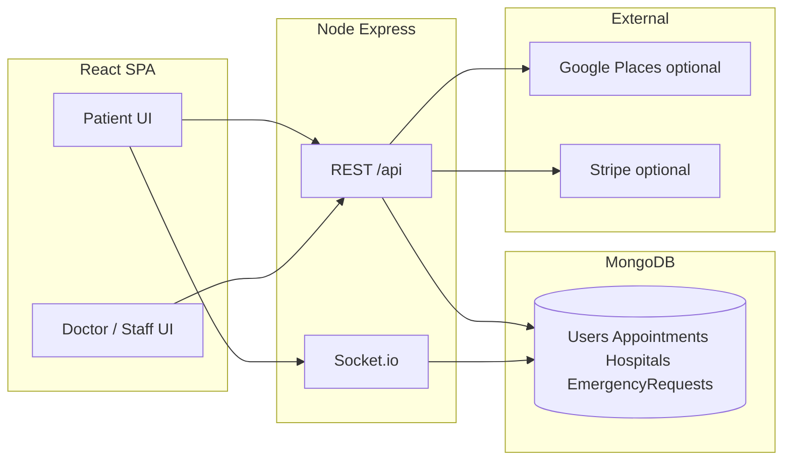

# How LifeCare+ was built (engineering notes)

This is not marketing copy. It is the kind of document I wish I had when starting — what broke, what we chose, and what is still rough.

**Live:** [App](https://lifecare-frontend-navy.vercel.app) · [API docs](https://lifecare-l42k.onrender.com/api/docs) · [Health](https://lifecare-l42k.onrender.com/health)

---

## Problem we were solving

Patients in India often juggle separate apps for doctors, pharmacy, and emergency help. LifeCare+ is a **single prototype** that stitches those flows together so I could practice full-stack patterns: auth, payments, real-time, geo queries, and a regulated-adjacent domain (health) without claiming to ship a real hospital product.

Scope is deliberately limited: **Hyderabad & outskirts** for emergency, **demo accounts** for interviews, **screening** not diagnosis for MediScan.

---

## Architecture (high level)



### Main collections (MongoDB)

| Collection | Why it exists |
|------------|----------------|
| `users` | Patients, doctors, pharmacy, ambulance drivers — one model with `userType` + embedded profile |
| `appointments` | Bookings, payment status, reminders — video join is gated on `paid` |
| `hospitals` | Partner facilities with `location` GeoJSON for `$geoNear` |
| `ambulanceunits` | Driver assignment + `currentLocation` for dispatch |
| `emergencyrequests` | SOS lifecycle: searching → dispatched → arrived → pickedUp |
| `medicines` / `orders` | Pharmacy cart and staff fulfillment |
| `healthrecords` / scan collections | MediScan results linked to patient vault |

Indexes that matter: `hospitals.location` **2dsphere**, `users` text on name/city, appointment status + patientId.

---

## Tech choices (and why)

### MongoDB instead of PostgreSQL

- Health demo data is nested (profile, medicalHistory, doctorDetails on one user doc).
- Emergency needs **geo queries** — Mongo’s `$geoNear` was faster to wire than PostGIS for a solo project.
- Trade-off: fewer relational guarantees; we accept that for a prototype.

### Socket.io instead of only REST

- WebRTC needs signaling (offer/answer/ICE).
- Ambulance location and emergency status are push, not poll-every-2-seconds.
- Trade-off: harder to scale horizontally without a Redis adapter (not needed at demo scale).

### WebRTC with STUN only (no TURN server)

- Google public STUN works on home WiFi and mobile hotspots.
- Corporate NAT / strict firewalls can block P2P — we document that and fall back to chat-only.
- A production app would add Twilio TURN or similar; we skipped cost/complexity.

### Hyderabad manual area picker (not GPS-first)

**This was a real bug story.** We shipped GPS-first SOS. On production (HTTPS Vercel) and on laptops, users got:

> "GPS signal not available…"

Fix path:

1. Better geolocation retries and error messages (still flaky on desktop).
2. **Pivoted:** 180+ named areas with lat/lng, search box, optional flat/landmark field.
3. Backend rejects coordinates outside Hyderabad bounds.
4. Seeded 25 partner hospitals at real coordinates + 6 ambulance staging points.

That iteration is visible in git: `59180c7`, `9c16833`, `dd91f47`.

### MediScan: remote API + local fallback

- Primary: optional `MEDISCAN_API_URL` (Render ML service).
- Fallback: integrated screening on the API when remote is down.
- Always labeled **screening assistance** — doctor review path exists in the doctor portal.

### Payments: wallet first, Stripe optional

- Interview demos use seeded wallet balance — no live Stripe keys required.
- Stripe PaymentIntents + webhook handler exist for real card flow when keys are set.

---

## Things that broke (and how we fixed them)

| Symptom | Root cause | Fix | Commit area |
|---------|------------|-----|-------------|
| Need Help did nothing on dashboard | `NeedHelpProvider` not mounted on `/dashboard` | Always mount provider; hide FAB only on dashboard home | `785dafb` |
| SOS showed Mumbai hospitals in Hyderabad | Random/fallback coords + wide Google search | Hyderabad bounds, tiered hospital search, partner seed data | `59180c7`, `dd91f47` |
| Site felt slow on mobile | Emergency maps + vitals loaded on first paint | Lazy chunks for modal, maps, vitals dashboard | `785dafb` |
| Demo login rate-limited | Auth limiter hit during interviews | Exempt demo-login route | `586d932` |
| Data lost after Render redeploy | In-memory Mongo fallback when Atlas unset | Document Atlas + `scripts/sync-render-env.mjs` | `docs/DEPLOY_ATLAS.md` |
| SMS spam on SOS create | Immediate Twilio to patient + contacts on dispatch | In-app notification only at create; SMS only when driver accepts (optional) | recent |

---

## Emergency SOS flow (current)

1. User opens **Need Help** → picks **Hyderabad area** (search or chips).
2. Optional: flat / building / landmark for apartments.
3. Nearest hospital from DB + Google Places (tiered 5→8→15 km).
4. Ambulance assigned from nearest available unit.
5. Socket.io room for live ETA + map.
6. Pickup OTP when driver marks arrived.

Not in scope: nationwide coverage, regulatory ambulance licensing, automatic SMS blast to family on button press.

---

## API surface

- **Swagger UI:** `/api/docs` — try endpoints with bearer token from `POST /api/auth/login`.
- **Health:** `/health` — shows DB connected, `integrations.googlePlaces`, `integrations.twilioSms`.

Key emergency routes:

- `GET /api/emergency/hyderabad-areas?q=`
- `GET /api/emergency/nearby-hospitals?lat=&lng=`
- `POST /api/emergency/sos` (patient, Hyderabad bounds enforced)

---

## What I would do next

1. Persistent Atlas on Render (not in-memory fallback).
2. TURN server for WebRTC in corporate networks.
3. Real screenshot set + 2-minute demo video in README.
4. MSG91 or Twilio with India DLT if SMS is required in production.
5. Split RapidCare and LifeCare deploy configs more clearly in docs.

---

## Running locally

```bash
npm install
cp backend/.env.example backend/.env
cp frontend/.env.example frontend/.env
npm run dev
```

Seed Hyderabad hospitals only:

```bash
npm run seed:hyderabad-emergency -w backend
```

---

## Honest disclaimer

LifeCare+ is an **interview and learning prototype**. It is not a medical device, not HIPAA-certified, and not intended for real emergencies beyond demonstrating UX — users should still call **108**.

See also: [PRIVACY_AND_SAFETY.md](../PRIVACY_AND_SAFETY.md) · [INTERVIEW_DEMO.md](../INTERVIEW_DEMO.md)
